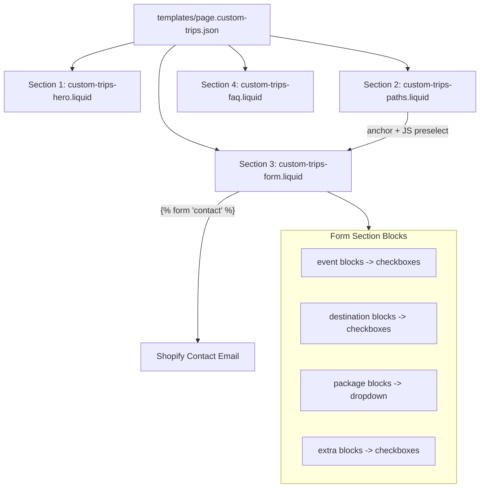

# Custom Trips Landing Page - Implementation Plan

## Styling Constraint: Theme-Native Design System

All sections MUST reuse the theme's existing design tokens. No new brand colors, fonts, or hardcoded values.

**Token reference (from `snippets/theme-styles-variables.liquid` and `snippets/color-schemes.liquid`):**

- **Colors** -- always inherit from the active `color_scheme` class:
  - Text: `var(--color-foreground)`, headings: `var(--color-foreground-heading)`
  - Background: `var(--color-background)`, accent: `var(--color-primary)`
  - Borders: `var(--color-border)`, muted text: `var(--color-foreground-muted)`
  - Buttons: `var(--color-primary-button-background)`, `var(--color-primary-button-text)`, etc.
  - Inputs: `var(--color-input-background)`, `var(--color-input-text)`, `var(--color-input-border)`
- **Typography** -- never hardcode font families or sizes:
  - Body: `var(--font-body--family)`, `var(--font-paragraph--size)`, `var(--font-paragraph--line-height)`
  - Headings: `var(--font-heading--family)`, `var(--font-h2--size)`, `var(--font-h3--size)`, etc.
  - Subheadings: `var(--font-subheading--family)`
  - Size scale: `var(--font-size--xs)` through `var(--font-size--6xl)`
- **Spacing** -- use theme tokens, not px:
  - Padding: `var(--padding-xs)` through `var(--padding-6xl)`
  - Gaps: `var(--gap-xs)` through `var(--gap-3xl)`
  - Margins: `var(--margin-xs)` through `var(--margin-6xl)`
- **Borders** -- use theme tokens:
  - Radius: `var(--style-border-radius-inputs)`, `var(--style-border-radius-buttons-primary)`, `var(--style-border-radius-sm)`, `var(--style-border-radius-md)`
  - Width: `var(--style-border-width)`, `var(--style-border-width-inputs)`
- **Component classes to reuse** (from `assets/base.css`):
  - Primary button: `.button` class (auto-uses `--color-primary-button-*`, `--style-border-radius-buttons-primary`, `--button-font-family-primary`)
  - Secondary button: `.button-secondary` class
  - Inputs/textareas: inherit `--color-input-background`, `--color-input-border`, `--input-padding`, `--style-border-radius-inputs`
- **Section-scoped overrides**: Only use `--cth-*`, `--ctp-*`, `--ctf-*` custom properties for layout dimensions (min-height, grid gaps). Never for colors or fonts.

---

## Architecture Overview




---

## 1. Template

**File:** `templates/page.custom-trips.json`

Standard JSON template referencing the 4 sections in order. Assign to a page titled "Custom Trips" in the Shopify admin.

```json
{
  "sections": {
    "hero": { "type": "custom-trips-hero", "settings": { ... } },
    "paths": { "type": "custom-trips-paths", "settings": { ... } },
    "form": { "type": "custom-trips-form", "settings": { ... }, "blocks": { ... } },
    "faq": { "type": "custom-trips-faq", "settings": { ... }, "blocks": { ... } }
  },
  "order": ["hero", "paths", "form", "faq"]
}
```

---

## 2. Section 1: Custom Trips Hero

**File:** [sections/custom-trips-hero.liquid](sections/custom-trips-hero.liquid)

Full-width hero banner with image, overlay, text content, and CTA. Applies `color-{{ color_scheme }}` class so all text/button colors resolve from the scheme.

### Schema Settings

- **Media group**
  - `image` (image_picker) -- Background Image
  - `image_mobile` (image_picker) -- Mobile Image
  - `min_height` (range 200-800, step 50, default 500) -- Min Height (px)
  - `min_height_mobile` (range 200-600, step 50, default 400) -- Mobile Min Height
- **Overlay group**
  - `overlay_opacity` (range 0-100, default 40) -- Overlay Opacity (uses `--color-background-rgb` at the chosen opacity so it stays in-scheme; merchant can override via a `color` setting that defaults to `#000000`)
- **Content group**
  - `heading` (text, default "Design Your Dream MTB Trip")
  - `subheading` (textarea)
  - `text_alignment` (select: left/center/right, default center)
- **Button group**
  - `button_label` (text, default "Start Planning")
  - `button_link` (url, defaults to `#custom-trip-form`)
- **Colors group**
  - `color_scheme` (color_scheme, default scheme-1) -- drives all foreground/bg/button colors
- **Spacing group**
  - `padding_top` / `padding_bottom` (range 0-100, default 0)

### CSS approach

- Section-scoped vars for **layout only**: `--cth-min-height`, `--cth-min-height-mobile`, `--cth-overlay-opacity`
- Typography: heading uses `font-family: var(--font-heading--family)`, `font-size: var(--font-h1--size)`, body text uses `var(--font-paragraph--*)` -- all inherited from theme
- CTA uses the `.button` class directly (inherits primary button colors/radius from the active color scheme)
- Overlay: `background: rgb(0 0 0 / var(--cth-overlay-opacity))` -- stays neutral regardless of scheme
- No hardcoded colors for text; text color comes from `var(--color-foreground)` or `var(--color-foreground-heading)` via the applied `.color-{{ scheme }}` class
- For hero specifically: since text overlays a dark image, we intentionally use `color: var(--color-primary-button-text)` (which is the "light-on-dark" text from the scheme) or let the merchant pick a scheme designed for dark backgrounds

### Markup Pattern

- `<section class="color-{{ color_scheme }}">` with background image via `<picture>` + `` (lazy loading)
- Overlay `<div>` with rgba
- Content container with heading (`<h1>`), subheading (`<p>`), CTA (`<a class="button">`)
- Responsive: mobile image swap via `<picture>` / `<source media>`

---

## 3. Section 2: Two-Path Selector

**File:** [sections/custom-trips-paths.liquid](sections/custom-trips-paths.liquid)

Two side-by-side cards, each representing a path. Cards link to the form section anchor and pre-select the correct radio via minimal inline JS.

### Schema Settings

- **Section group**
  - `heading` (text, default "How Would You Like to Start?")
  - `subheading` (textarea)
  - `color_scheme` (color_scheme, default scheme-1)
- **Card A group**
  - `card_a_title` (text, default "Build from Scratch")
  - `card_a_description` (textarea, default "Choose your events, destinations, dates...")
  - `card_a_image` (image_picker)
  - `card_a_button_label` (text, default "Start Building")
- **Card B group**
  - `card_b_title` (text, default "Customize a Package")
  - `card_b_description` (textarea, default "Take one of our existing packages...")
  - `card_b_image` (image_picker)
  - `card_b_button_label` (text, default "Choose a Package")
- **Spacing group**
  - `padding_top` / `padding_bottom` (range 0-100, default 48)

### CSS approach

- Cards use `var(--color-background)` bg, `var(--color-border)` border, `var(--style-border-radius-md)` radius
- Card title: `font-family: var(--font-heading--family)`, `font-size: var(--font-h3--size)`
- Card description: `font-family: var(--font-body--family)`, `color: var(--color-foreground)`
- Card CTA: `.button-secondary` class (inherits secondary button styling from scheme)
- Hover: `border-color: var(--color-primary)` for accent highlight
- Grid gap: `var(--gap-2xl)`

### Behavior

- Each card is a clickable `<a>` pointing to `#custom-trip-form`
- Tiny inline `<script>` (~8 lines) on this section: on card click, checks the correct radio button and smooth-scrolls
- Progressive enhancement: without JS, links still scroll to the form; user picks the radio manually

---

## 4. Section 3: Custom Trip Form (The Core)

**File:** [sections/custom-trips-form.liquid](sections/custom-trips-form.liquid)

This is the most complex section. Uses Shopify's `` tag. Two conditional fieldsets toggled via **CSS `:has()` pseudo-class** (no JS required for toggle).

### Conditional Display Mechanism

```css
/* Default: hide both path-specific fieldsets */
.ct-form__scratch-fields,
.ct-form__customize-fields { display: none; }

/* Show based on which radio is checked */
.ct-form:has(#ct-path-scratch:checked) .ct-form__scratch-fields { display: block; }
.ct-form:has(#ct-path-customize:checked) .ct-form__customize-fields { display: block; }

/* Also toggle shared fields visibility after a path is chosen */
.ct-form:has(input[name="contact[request_type]"]:checked) .ct-form__shared-fields { display: block; }
```

`:has()` has universal browser support as of 2024+ (Chrome 105, Firefox 121, Safari 15.4). No JS fallback needed.

### HTML Structure

```
<section id="custom-trip-form" class="color-{{ color_scheme }}">
  <form 'contact'>
    <input type="hidden" name="contact[subject]" value="Custom Trip Request">

    <!-- Step 1: Path selector (radios) -->
    <fieldset class="ct-form__type-selector">
      <legend>What would you like to do?</legend>
      <label for="ct-path-scratch">
        <input type="radio" id="ct-path-scratch" name="contact[request_type]" value="Build from Scratch">
        Build a Trip from Scratch
      </label>
      <label for="ct-path-customize">
        <input type="radio" id="ct-path-customize" name="contact[request_type]" value="Customize a Package">
        Customize an Existing Package
      </label>
    </fieldset>

    <!-- Path A fields (shown when "scratch" selected) -->
    <div class="ct-form__scratch-fields">
      events checkboxes, destinations checkboxes, dates
    </div>

    <!-- Path B fields (shown when "customize" selected) -->
    <div class="ct-form__customize-fields">
      package dropdown, customization checkboxes, dates
    </div>

    <!-- Shared fields (shown when any path selected) -->
    <div class="ct-form__shared-fields">
      rider level, group size, budget, extras, notes, contact info
    </div>

    <button type="submit" class="button">Submit Request</button>
  </form>
</section>
```

### CSS approach for form elements

- All `<input>`, `<textarea>`, `<select>` inherit from base.css: `var(--color-input-background)`, `var(--color-input-text)`, `var(--color-input-border)`, `var(--style-border-radius-inputs)`, `var(--input-padding)`
- Labels: `font-family: var(--font-body--family)`, `color: var(--color-foreground)`
- Fieldset legends / group headings: `font-family: var(--font-heading--family)`, `font-size: var(--font-h3--size)` or `var(--font-h4--size)`
- Submit button: `.button` class (primary button styling from active color scheme)
- Radio cards for path selector: `var(--color-background)` bg, `var(--color-border)` border, on `:checked` -> `border-color: var(--color-primary)`, `box-shadow: 0 0 0 1px var(--color-primary)`
- Section heading: `font-family: var(--font-heading--family)`, `font-size: var(--font-h2--size)`
- Form field gap: `var(--gap-lg)`, section gap: `var(--gap-2xl)`
- Error styling: `var(--color-error)` (already defined as `#8B0000` in theme-styles-variables)
- Success styling: `var(--color-success)` (already defined as `#006400`)
- Focus: inherits global `:focus-visible` outline from base.css (`--focus-outline-width`, `--focus-outline-offset`)

### Schema Settings (Section-level)

- **Content group**
  - `heading` (text, default "Tell Us About Your Dream Trip")
  - `description` (textarea)
  - `submit_label` (text, default "Send My Request")
  - `success_message` (textarea, default "Thanks! We'll be in touch within 24h.")
- **Labels group**
  - `scratch_label` (text, default "Build from Scratch")
  - `customize_label` (text, default "Customize a Package")
- **Colors group**
  - `color_scheme` (color_scheme, default scheme-1) -- drives ALL colors; no separate accent_color setting needed since `--color-primary` serves as accent
- **Spacing group**
  - `padding_top` / `padding_bottom` (range 0-100, default 48)

### Schema Blocks (Merchant-Editable Lists)

**Block type: `event**` (limit: 20)


| ID          | Type   | Label                | Default               |
| ----------- | ------ | -------------------- | --------------------- |
| `name`      | `text` | Event Name           | "Enduro World Series" |
| `date_hint` | `text` | Date Hint (optional) | "June 2026"           |


**Block type: `destination**` (limit: 20)


| ID       | Type   | Label             | Default         |
| -------- | ------ | ----------------- | --------------- |
| `name`   | `text` | Destination Name  | "Whistler, BC"  |
| `region` | `text` | Region (optional) | "North America" |


**Block type: `package**` (limit: 10)


| ID            | Type   | Label             | Default                |
| ------------- | ------ | ----------------- | ---------------------- |
| `name`        | `text` | Package Name      | "Whistler Enduro Week" |
| `description` | `text` | Short Description | "7 days / 6 nights"    |
| `price_hint`  | `text` | Price Hint        | "From $2,400"          |


**Block type: `extra**` (limit: 15)


| ID            | Type   | Label                  | Default                       |
| ------------- | ------ | ---------------------- | ----------------------------- |
| `name`        | `text` | Extra Name             | "Bike Rental"                 |
| `description` | `text` | Description (optional) | "Full-suspension enduro bike" |


### Complete Form Fields Spec

**Hidden fields (always submitted):**

- `contact[subject]` = "Custom Trip Request" (hidden input, value from setting)
- `contact[request_type]` = value of selected radio

**Path A: Build from Scratch**


| Field ID          | HTML Type  | Name Attribute             | Label           | Notes                              |
| ----------------- | ---------- | -------------------------- | --------------- | ---------------------------------- |
| `ct-events`       | checkboxes | `contact[events]`          | Events          | One per event block; values joined |
| `ct-destinations` | checkboxes | `contact[destinations]`    | Destinations    | One per destination block          |
| `ct-dates`        | text       | `contact[preferred_dates]` | Preferred Dates | Free text, v1                      |


**Path B: Customize Package**


| Field ID          | HTML Type  | Name Attribute             | Label           | Notes                                                           |
| ----------------- | ---------- | -------------------------- | --------------- | --------------------------------------------------------------- |
| `ct-package`      | select     | `contact[base_package]`    | Base Package    | Options from package blocks                                     |
| `ct-custom-type`  | checkboxes | `contact[customization]`   | What to Change  | Extend duration, Shorten, Add destinations, Change dates, Other |
| `ct-custom-dates` | text       | `contact[preferred_dates]` | Preferred Dates | Free text                                                       |


**Shared Fields (both paths)**


| Field ID         | HTML Type  | Name Attribute          | Label            | Notes                                                   |
| ---------------- | ---------- | ----------------------- | ---------------- | ------------------------------------------------------- |
| `ct-rider-level` | select     | `contact[rider_level]`  | Rider Level      | Beginner / Intermediate / Advanced / Expert             |
| `ct-group-size`  | select     | `contact[group_size]`   | Group Size       | Solo / 2 / 3-4 / 5-8 / 8+                               |
| `ct-budget`      | select     | `contact[budget_range]` | Budget Range     | <$1k / $1k-2.5k / $2.5k-5k / $5k-10k / $10k+ / Flexible |
| `ct-extras`      | checkboxes | `contact[extras]`       | Extras           | One per extra block                                     |
| `ct-notes`       | textarea   | `contact[body]`         | Additional Notes | Maps to Shopify's default body field                    |
| `ct-name`        | text       | `contact[name]`         | Full Name        | required                                                |
| `ct-email`       | email      | `contact[email]`        | Email Address    | required (Shopify mandates this)                        |
| `ct-phone`       | tel        | `contact[phone]`        | WhatsApp / Phone | with country code hint                                  |
| `ct-country`     | text       | `contact[country]`      | Country          | Free text input                                         |
| `ct-timezone`    | select     | `contact[timezone]`     | Timezone         | UTC offsets or IANA zones                               |


### Checkbox Handling for Email

Shopify contact form sends all `contact[*]` fields in the notification email. For checkbox groups (events, destinations, extras), use this pattern:

```liquid

  
    <label>
      <input type="checkbox" name="contact[events]" value="{{ block.settings.name }}">
      {{ block.settings.name }}
    </label>
  

```

Multiple checkboxes with the same `name` attribute send comma-separated values in the email. The merchant receives a structured email like:

```
Subject: Custom Trip Request
Request Type: Build from Scratch
Events: Enduro World Series, Red Bull Rampage
Destinations: Whistler BC, Moab UT
Preferred Dates: Late June 2026
Rider Level: Advanced
Group Size: 3-4
Budget Range: $2.5k-5k
Extras: Bike Rental, Guided Park Day, Lodging Upgrade
Notes: We'd love a rest day mid-trip for exploring town...
Name: John Doe
Email: john@example.com
Phone: +1 555 123 4567
Country: United States
Timezone: UTC-7 (Mountain)
```

---

## 5. Section 4: FAQ / Trust

**File:** [sections/custom-trips-faq.liquid](sections/custom-trips-faq.liquid)

Accordion-style FAQ with merchant-editable blocks. Uses `<details>`/`<summary>` for native HTML accordion (no JS).

### Schema Settings

- `heading` (text, default "Frequently Asked Questions")
- `subheading` (textarea)
- `color_scheme` (color_scheme, default scheme-1)
- `padding_top` / `padding_bottom` (range 0-100, default 48)

### Schema Blocks

**Block type: `faq**` (limit: 20)

- `question` (text) -- Question
- `answer` (richtext) -- Answer

**Block type: `trust_badge**` (limit: 6)

- `icon` (image_picker) -- Icon
- `text` (text) -- Badge Text

### CSS approach

- Section heading: `var(--font-heading--family)`, `var(--font-h2--size)`, `color: var(--color-foreground-heading)`
- `<summary>`: `font-family: var(--font-body--family)`, `font-weight: var(--font-body--weight)` bold, `font-size: var(--font-size--lg)`, `color: var(--color-foreground)`, `padding: var(--padding-lg) 0`
- `<summary>` border: `border-bottom: var(--style-border-width) solid var(--color-border)`
- Answer text: inherits body typography from scheme, `color: var(--color-foreground)`
- Expand/collapse chevron: `color: var(--color-foreground)`
- Trust badges: `color: var(--color-foreground)`, `gap: var(--gap-xl)`
- Entire section inside `.color-{{ color_scheme }}` class

### Markup

- `<details>` + `<summary>` for each FAQ block (native accordion, accessible, no JS)
- Trust badges rendered as a horizontal row below the FAQ

---

## 6. Events List: Recommendation

**v1 (Blocks):** Best merchant UX for a small catalog. Merchant adds/removes/reorders events directly in the theme editor. Each block type (`event`, `destination`, `package`, `extra`) has simple text settings. Rendered as form options (checkboxes/dropdowns). Limit: 20 per type is more than enough.

**v2 (Metaobjects):** For larger catalogs or when events need richer data (images, multi-day schedules, locations, capacity). Metaobject definitions for Event, Destination, Package. Form section uses metaobject list picker setting. Requires Shopify admin setup but scales better.

**Not recommended:** Schema textarea (comma-separated). Poor merchant UX, error-prone, no validation.

---

## 7. Submission Wiring

- Form uses `` Liquid tag (same as existing [blocks/contact-form.liquid](blocks/contact-form.liquid))
- Submits to Shopify's built-in `/contact` endpoint
- Email goes to the store owner (Settings > Notifications > Customer notifications > Contact form)
- Hidden field `contact[subject]` structures the email subject
- All `contact[*]` fields appear in the notification email body
- Success/error handling follows the existing pattern: `form.posted_successfully?` and `form.errors`
- For v2: Shopify Flow automation to route to CRM, Slack, etc.

---

## 8. Merchant-Friendliness

- **Presets**: Each section ships with a preset containing sensible defaults and sample blocks (3 events, 3 destinations, 3 packages, 6 extras)
- **Logical setting groups**: Headers separate Media, Content, Colors, Spacing in each section
- **Mobile controls**: Separate `min_height_mobile`, `image_mobile` on hero; form grid collapses to single column via standard media queries
- **Section-scoped CSS variables**: Only for layout dimensions (min-height, grid columns). Colors, fonts, borders, and spacing always come from theme tokens or the active color scheme.
- **No hard-coded text**: All labels come from schema settings, all form option text comes from blocks
- **Color scheme support**: Every section applies `.color-{{ section.settings.color_scheme }}` so the merchant can theme each section independently using the same palette they configured globally. No custom color pickers needed -- `color_scheme` is the only color setting.
- **Zero new fonts or colors**: Buttons use `.button` / `.button-secondary` classes directly. Inputs inherit base.css styles. Headings use `var(--font-heading--family)`. Body text uses `var(--font-body--family)`. No `font-family:` or `color:` hardcoded anywhere in section CSS.

---

## 9. v1 vs v2 Upgrade Path

### v1 (This Implementation)

- 4 sections, 1 template
- Blocks for events/destinations/packages/extras
- CSS `:has()` for path toggling (no JS for toggle)
- Minimal JS only for path-selector card -> form radio preselect (~10 lines)
- Free-text date field
- Native `<details>` accordion for FAQ
- Shopify contact form email for submissions

### v2 (Future Enhancements)

- **Date picker**: Replace free-text with Flatpickr or native date inputs with range support
- **Metaobjects**: Replace blocks with metaobject entries for events/destinations (richer data, images, availability)
- **Multi-step form**: Break the form into a wizard with step indicators (JS web component)
- **File upload**: Allow riders to attach route GPX files or reference images
- **Shopify Flow**: Auto-create draft orders, send to CRM, trigger Slack notifications
- **Dynamic pricing**: Show estimated price range based on selections
- **Calendar integration**: Show event calendar with available dates
- **AJAX submission**: Submit without page reload, show inline success

---

## 10. Execution Order

Files to create, in order of implementation:

1. `sections/custom-trips-hero.liquid` (simplest, establishes CSS variable pattern)
2. `sections/custom-trips-faq.liquid` (standalone, no dependencies)
3. `sections/custom-trips-form.liquid` (the core, most complex)
4. `sections/custom-trips-paths.liquid` (depends on form section's radio IDs)
5. `templates/page.custom-trips.json` (wire everything together with presets)
6. Add translation keys to `locales/en.default.schema.json` if using `t:` keys (optional for v1; can use raw strings)

### Accessibility Checklist (per workspace rules)

- All form inputs have associated `<label>` elements (visible, not just `aria-label`)
- `aria-required="true"` on email and name fields
- `aria-invalid` + `aria-describedby` for error states
- `<fieldset>` + `<legend>` for radio and checkbox groups
- Focus management on form success/error (existing pattern from contact-form block)
- Skip link target on form section (`id="custom-trip-form"`, `tabindex="-1"`)
- Color contrast minimum 4.5:1 for all text
- `:focus-visible` styles on all interactive elements

