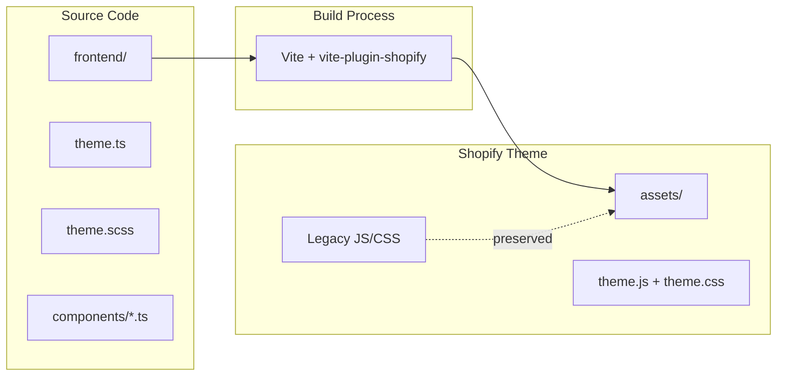
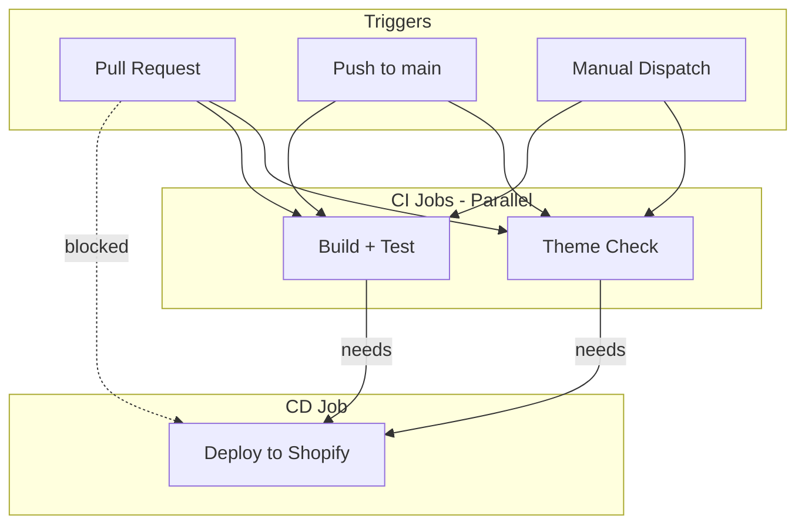

# Horizon Theme - Modernized with Vite

A modernized Shopify Horizon theme using **Parallel Architecture** to integrate modern build tooling without breaking legacy functionality.

## Table of Contents

- [Project Architecture](#project-architecture)
- [Tech Stack](#tech-stack)
- [Getting Started](#getting-started)
- [Development Workflow](#development-workflow)
- [CI/CD Pipeline](#cicd-pipeline)
- [Project Structure](#project-structure)
- [Configuration Files](#configuration-files)

---

## Project Architecture

This project uses a **Parallel Architecture** strategy that allows modern development practices to coexist with the traditional Shopify theme structure.

### The Two-World Approach

| Directory | Purpose | Technology |
|-----------|---------|------------|
| `assets/` | Shopify theme assets (legacy + compiled) | Vanilla JS, CSS |
| `frontend/` | Modern source code | TypeScript, Lit, SCSS |

### How It Works



### Key Principle: Never Delete Legacy Assets

Vite is configured with `emptyOutDir: false` to ensure existing theme assets are **never deleted or overwritten** during builds. This means:

- All original Horizon theme JavaScript files remain intact
- All original CSS files remain intact
- New compiled assets (`theme.js`, `theme.css`) are added alongside them
- Zero risk of breaking existing functionality

---

## Tech Stack

| Tool | Version | Purpose |
|------|---------|---------|
| **Vite** | 5.x | Build tool with Hot Module Replacement (HMR) |
| **vite-plugin-shopify** | 3.x | Shopify-specific Vite integration |
| **Lit** | 3.x | Web components library (~5KB, standards-compliant) |
| **Vitest** | 1.x | Unit testing framework with jsdom |
| **TypeScript** | 5.x | Type safety for components |
| **Sass** | 1.x | SCSS preprocessing |
| **Shopify CLI** | Latest | Local development and deployment |

### Why These Tools?

**Lit** was chosen over React/Vue because:
- True standards-compliant web components (works anywhere)
- Small footprint (~5KB vs 40KB+ for React)
- No virtual DOM overhead
- Works inside Shadow DOM with CSS Custom Properties

**Vite** was chosen because:
- Lightning-fast HMR during development
- Native ES modules support
- Perfect Shopify integration via `vite-plugin-shopify`
- Handles flat output structure required by Shopify

---

## Getting Started

### Prerequisites

- Node.js 20.x or higher
- npm 10.x or higher
- Shopify CLI installed globally

### Installation

```bash
# Clone the repository
git clone <your-repo-url>
cd horizon-test-data

# Install dependencies
npm install

# Build assets (first time)
npm run build
```

### Connect to Your Shopify Store

```bash
# Login to Shopify
shopify auth login

# Start development
shopify theme dev --store your-store.myshopify.com
```

---

## Development Workflow

### Available Scripts

| Command | Description |
|---------|-------------|
| `npm run dev` | Start Vite dev server with HMR |
| `npm run build` | Compile TypeScript/SCSS to `assets/` |
| `npm run test` | Run unit tests once |
| `npm run test:watch` | Run tests in watch mode |
| `npm run preview` | Preview production build |

### Local Development (Recommended Setup)

Run two terminals in parallel:

**Terminal 1: Vite Dev Server**
```bash
npm run dev
```

**Terminal 2: Shopify Theme Dev**
```bash
shopify theme dev --store your-store.myshopify.com
```

This setup provides:
- Hot Module Replacement for your modern components
- Live preview of your theme in the browser
- Automatic asset recompilation on save

### Creating New Components

1. Create a new Lit component in `frontend/components/`:

```typescript
// frontend/components/my-component.ts
import { LitElement, html, css } from 'lit';
import { customElement, property } from 'lit/decorators.js';

@customElement('my-component')
export class MyComponent extends LitElement {
  static styles = css`
    :host {
      display: block;
    }
  `;

  @property({ type: String })
  message = 'Hello World';

  render() {
    return html`<p>${this.message}</p>`;
  }
}
```

2. Import it in `frontend/entrypoints/theme.ts`:

```typescript
import '@components/my-component';
```

3. Use it in any Liquid template:

```liquid
<my-component message="Welcome!"></my-component>
```

### Writing Tests

Create tests in `test/components/`:

```typescript
// test/components/my-component.test.ts
import { describe, it, expect } from 'vitest';
import '../../frontend/components/my-component';

describe('MyComponent', () => {
  it('should be defined', () => {
    expect(customElements.get('my-component')).toBeDefined();
  });
});
```

Run tests:
```bash
npm run test
```

---

## CI/CD Pipeline

The project includes a GitHub Actions workflow that automates testing and deployment.

### Pipeline Flow



### Behavior by Trigger

| Trigger | Lint | Test | Build | Deploy |
|---------|------|------|-------|--------|
| Pull Request | Yes | Yes | Yes | **No** |
| Push to main | Yes | Yes | Yes | Yes |
| Manual dispatch | Yes | Yes | Yes | Yes |

### Safety Checks

1. **Theme Check** - Validates Liquid syntax and best practices
2. **Unit Tests** - Runs Vitest test suite
3. **Build** - Compiles TypeScript/SCSS without errors
4. **Deploy** - Only runs if ALL previous checks pass

### Required GitHub Secrets

Configure these in your repository settings under **Settings > Secrets and variables > Actions**:

| Secret | Description | How to Get |
|--------|-------------|------------|
| `SHOPIFY_CLI_THEME_TOKEN` | Theme Access token for authentication | Run `shopify theme token` locally |
| `SHOPIFY_STORE` | Your store URL (e.g., `my-store.myshopify.com`) | Your Shopify admin URL |
| `SHOPIFY_THEME_ID` | Target theme ID for deployment | Run `shopify theme list --store your-store.myshopify.com` |

### File Exclusions

The `.shopifyignore` file prevents uploading development files to Shopify:

- `node_modules/` - npm packages
- `frontend/` - source code (only compiled output is uploaded)
- `test/` - unit tests
- `.github/` - CI/CD configuration
- `*.map` - source maps
- `*.md` - documentation

---

## Project Structure

```
horizon-test-data/
├── assets/                    # Shopify theme assets (legacy + compiled)
│   ├── *.js                   # Legacy JavaScript (untouched)
│   ├── *.css                  # Legacy CSS (untouched)
│   ├── *.svg                  # Icons and images
│   ├── theme.js               # Vite output (generated)
│   └── theme.css              # Vite output (generated)
│
├── frontend/                  # Modern source code
│   ├── components/            # Lit web components
│   │   └── product-card.ts    # Example component
│   └── entrypoints/           # Vite entry points
│       ├── theme.ts           # JavaScript entry
│       └── theme.scss         # Styles entry
│
├── test/                      # Unit tests
│   └── components/
│       └── product-card.test.ts
│
├── blocks/                    # Shopify theme blocks
├── sections/                  # Shopify Liquid sections
├── snippets/                  # Shopify Liquid snippets
│   └── vite-tag.liquid        # Vite HMR/asset loader
├── templates/                 # Shopify JSON templates
├── config/                    # Shopify theme settings
├── locales/                   # Translation files
├── layout/                    # Theme layouts
│
├── .github/
│   └── workflows/
│       └── deploy.yml         # CI/CD pipeline
│
├── package.json               # Node.js dependencies and scripts
├── vite.config.js             # Vite build configuration
├── vitest.config.js           # Test configuration
├── tsconfig.json              # TypeScript configuration
├── .shopifyignore             # Files excluded from Shopify upload
├── .theme-check.yml           # Theme Check linter configuration
├── .gitignore                 # Git ignore rules
└── README.md                  # This file
```

---

## Configuration Files

### vite.config.js

Key settings:
- `emptyOutDir: false` - Preserves existing assets
- Flat output structure for Shopify compatibility
- Path aliases for clean imports (`@components`, `@styles`)

### tsconfig.json

- ES2020 target for modern browsers
- Strict mode enabled
- Decorator support for Lit

### .shopifyignore

Excludes development files from theme uploads:
- Source code (`frontend/`, `test/`)
- Build tools (`node_modules/`, config files)
- CI/CD files (`.github/`)
- Documentation (`*.md`)

### .theme-check.yml

Configures Theme Check to ignore:
- Node.js files
- Frontend source code
- Test files
- Vite-generated assets

---

## Troubleshooting

### Build fails with "emptyOutDir" warning

Ensure `vite.config.js` has `emptyOutDir: false` in the build options.

### Components not rendering

1. Check that the component is imported in `frontend/entrypoints/theme.ts`
2. Verify `` is in your Liquid layout
3. Run `npm run build` and check `assets/theme.js` exists

### Theme Check errors on TypeScript files

The `.theme-check.yml` should exclude `frontend/` and `test/` directories.

### HMR not working

Ensure both Vite dev server (`npm run dev`) and Shopify CLI (`shopify theme dev`) are running simultaneously.

---

## Contributing

1. Create a feature branch from `main`
2. Make your changes
3. Write/update tests
4. Open a Pull Request
5. Wait for CI checks to pass
6. Merge after review

---

## License

Based on the [Shopify Horizon Theme](https://github.com/Shopify/horizon).
# Shopify-dev-curs

