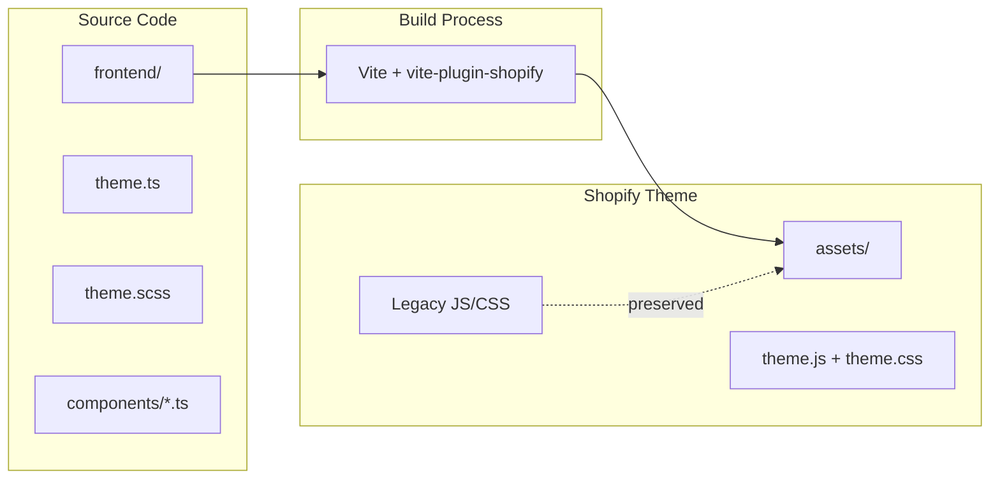
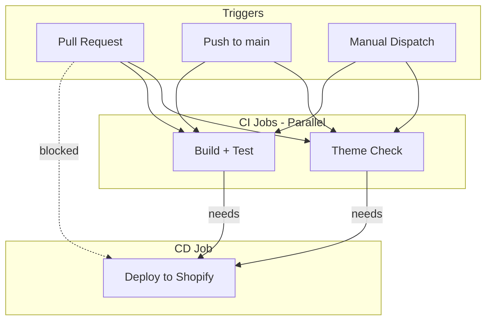

# Andes Freeride

Shopify storefront and digital platform for Andes Freeride, a mountain bike travel company focused on bringing riders from Canada and North America to Chile.

The project combines Shopify, modern frontend tooling, CI/CD automation, and future booking workflows to create a scalable platform for MTB tourism experiences.

## Business Overview

Andes Freeride currently offers curated mountain bike travel experiences in Chile.

Current offerings:
- Nevados de Chillán MTB Package
- Roca Park MTB Package

The website serves as:
- Marketing website
- Lead generation platform
- Travel package showcase
- Future booking platform
- Customer acquisition funnel

## Problem

Mountain bike travelers often discover destinations, guides, accommodations, and riding experiences through fragmented channels such as social media, forums, word of mouth, and direct messaging.

This creates friction for riders trying to evaluate destinations and for operators trying to convert interest into bookings.

For Chile in particular, there is no dominant digital platform focused specifically on curated MTB travel experiences for international riders.

## Solution

Andes Freeride is being built as a dedicated MTB travel platform focused on showcasing premium riding experiences in Chile.

The long-term goal is to provide a seamless path from discovery to booking while helping riders understand destinations, packages, logistics, accommodations, and riding options.

The platform is designed to evolve through multiple phases:

1. Marketing and lead generation
2. Package discovery and qualification
3. Booking coordination workflows
4. Customer management and repeat business
5. Operational automation and analytics

## Project Status

### Completed
- Shopify store setup
- Horizon theme foundation
- Vite integration
- GitHub repository setup
- Automated CI/CD deployment to Shopify
- Theme Check validation pipeline
- Automated build and test workflow

### In Progress
- Homepage customization
- Package landing pages
- Lead capture workflows
- Content architecture for MTB travel packages

### Planned
- Booking workflow
- Customer profile system
- CRM integration
- Analytics and conversion tracking
- Marketing automation

## Product Vision

The objective is not simply to build a Shopify website.

The objective is to create a scalable digital platform that can support:

- MTB travel package sales
- Customer acquisition
- Booking management
- Rider profiles
- Partner and accommodation coordination
- Marketing automation
- Performance analytics

The current Shopify implementation acts as the foundation layer for future platform capabilities.

---

## Project Architecture

This project uses a parallel architecture that allows modern frontend development to coexist with Shopify's native theme structure. The goal is to preserve Shopify compatibility while enabling scalable development practices suitable for a growing travel business.

### The Two-World Approach

| Directory | Purpose | Technology |
|-----------|---------|------------|
| `assets/` | Shopify theme assets (legacy + compiled) | Vanilla JS, CSS |
| `frontend/` | Modern source code | TypeScript, Lit, SCSS |

### How It Works



### Key Principle: Never Delete Legacy Assets

Vite is configured with `emptyOutDir: false` to ensure existing theme assets are **never deleted or overwritten** during builds. This means:

- All original Horizon theme JavaScript files remain intact
- All original CSS files remain intact
- New compiled assets (`theme.js`, `theme.css`) are added alongside them
- Zero risk of breaking existing functionality

---

## Tech Stack

| Tool | Version | Purpose |
|------|---------|---------|
| **Vite** | 5.x | Build tool with Hot Module Replacement (HMR) |
| **vite-plugin-shopify** | 3.x | Shopify-specific Vite integration |
| **Lit** | 3.x | Web components library (~5KB, standards-compliant) |
| **Vitest** | 1.x | Unit testing framework with jsdom |
| **TypeScript** | 5.x | Type safety for components |
| **Sass** | 1.x | SCSS preprocessing |
| **Shopify CLI** | Latest | Local development and deployment |

## Engineering Decisions

### Why Shopify

Shopify provides a stable ecommerce foundation, excellent hosting, content management capabilities, and a proven ecosystem for future commercial operations.

### Why Vite

Vite provides fast local development, modern build tooling, and an efficient workflow while remaining compatible with Shopify theme requirements.

### Why GitHub Actions

GitHub Actions enables automated validation and deployment workflows, reducing manual deployment risk and improving development reliability.

### Why Parallel Architecture

The project preserves compatibility with Shopify's native architecture while allowing modern frontend development practices to coexist without disrupting existing functionality.

---

## Getting Started

### Prerequisites

- Node.js 20.x or higher
- npm 10.x or higher
- Shopify CLI installed globally

### Installation

```bash
# Clone the repository
git clone <your-repo-url>
cd andes-freeride-theme

# Install dependencies
npm install

# Build assets (first time)
npm run build
```

### Connect to Your Shopify Store

```bash
# Login to Shopify
shopify auth login

# Start development
shopify theme dev --store your-store.myshopify.com
```

---

## Development Workflow

### Available Scripts

| Command | Description |
|---------|-------------|
| `npm run dev` | Start Vite dev server with HMR |
| `npm run build` | Compile TypeScript/SCSS to `assets/` |
| `npm run test` | Run unit tests once |
| `npm run test:watch` | Run tests in watch mode |
| `npm run preview` | Preview production build |

### Local Development (Recommended Setup)

Run two terminals in parallel:

**Terminal 1: Vite Dev Server**
```bash
npm run dev
```

**Terminal 2: Shopify Theme Dev**
```bash
shopify theme dev --store your-store.myshopify.com
```

This setup provides:
- Hot Module Replacement for your modern components
- Live preview of your theme in the browser
- Automatic asset recompilation on save

---

## CI/CD Pipeline

The production deployment flow is fully automated through GitHub Actions.

Workflow:

GitHub Push (main)
→ Theme Check
→ Build & Test
→ Deploy to Shopify Theme

Deployment only occurs when all validation steps pass successfully.

The project includes a GitHub Actions workflow that automates testing and deployment.

### Pipeline Flow



### Behavior by Trigger

| Trigger | Lint | Test | Build | Deploy |
|---------|------|------|-------|--------|
| Pull Request | Yes | Yes | Yes | **No** |
| Push to main | Yes | Yes | Yes | Yes |
| Manual dispatch | Yes | Yes | Yes | Yes |

### Safety Checks

1. **Theme Check** - Validates Liquid syntax and best practices
2. **Unit Tests** - Runs Vitest test suite
3. **Build** - Compiles TypeScript/SCSS without errors
4. **Deploy** - Only runs if ALL previous checks pass

### Required GitHub Secrets

Configure these in your repository settings under **Settings > Secrets and variables > Actions**:

| Secret | Description | How to Get |
|--------|-------------|------------|
| `SHOPIFY_CLI_THEME_TOKEN` | Theme Access token for authentication | Run `shopify theme token` locally |
| `SHOPIFY_STORE` | Your store URL (e.g., `my-store.myshopify.com`) | Your Shopify admin URL |
| `SHOPIFY_THEME_ID` | Target theme ID for deployment | Run `shopify theme list --store your-store.myshopify.com` |

### Deployment Notes

How to find the Theme ID:


shopify theme list --store your-store.myshopify.com


How to verify deployment:

1. Open GitHub Actions and confirm the workflow completed successfully.
2. Verify the deployed commit SHA matches the latest commit on main.
3. Open Shopify Admin → Online Store → Themes.
4. Confirm the expected changes are visible in the target theme.

If deployment succeeds in GitHub but changes are not visible, verify that the correct Theme ID is configured in the repository secrets.

### File Exclusions

The `.shopifyignore` file prevents uploading development files to Shopify:

- `node_modules/` - npm packages
- `frontend/` - source code (only compiled output is uploaded)
- `test/` - unit tests
- `.github/` - CI/CD configuration
- `*.map` - source maps
- `*.md` - documentation

---

## Project Structure

```
andes-freeride-theme/
├── assets/                    # Shopify theme assets (legacy + compiled)
│   ├── *.js                   # Legacy JavaScript (untouched)
│   ├── *.css                  # Legacy CSS (untouched)
│   ├── *.svg                  # Icons and images
│   ├── theme.js               # Vite output (generated)
│   └── theme.css              # Vite output (generated)
│
├── frontend/                  # Modern source code
│   ├── components/            # Lit web components
│   │   └── future custom components
│   └── entrypoints/           # Vite entry points
│       ├── theme.ts           # JavaScript entry
│       └── theme.scss         # Styles entry
│
├── test/                      # Unit tests
│   └── components/
│       └── future test suites
│
├── blocks/                    # Shopify theme blocks
├── sections/                  # Shopify Liquid sections
├── snippets/                  # Shopify Liquid snippets
│   └── vite-tag.liquid        # Vite HMR/asset loader
├── templates/                 # Shopify JSON templates
├── config/                    # Shopify theme settings
├── locales/                   # Translation files
├── layout/                    # Theme layouts
│
├── .github/
│   └── workflows/
│       └── deploy.yml         # CI/CD pipeline
│
├── package.json               # Node.js dependencies and scripts
├── vite.config.js             # Vite build configuration
├── vitest.config.js           # Test configuration
├── tsconfig.json              # TypeScript configuration
├── .shopifyignore             # Files excluded from Shopify upload
├── .theme-check.yml           # Theme Check linter configuration
├── .gitignore                 # Git ignore rules
└── README.md                  # This file
```

---

## Configuration Files

### vite.config.js

Key settings:
- `emptyOutDir: false` - Preserves existing assets
- Flat output structure for Shopify compatibility
- Path aliases for clean imports (`@components`, `@styles`)

### tsconfig.json

- ES2020 target for modern browsers
- Strict mode enabled
- Decorator support for Lit

### .shopifyignore

Excludes development files from theme uploads:
- Source code (`frontend/`, `test/`)
- Build tools (`node_modules/`, config files)
- CI/CD files (`.github/`)
- Documentation (`*.md`)

### .theme-check.yml

Configures Theme Check to ignore:
- Node.js files
- Frontend source code
- Test files
- Vite-generated assets

---

## Troubleshooting

### Build fails with "emptyOutDir" warning

Ensure `vite.config.js` has `emptyOutDir: false` in the build options.

### Components not rendering

1. Check that the component is imported in `frontend/entrypoints/theme.ts`
2. Verify `` is in your Liquid layout
3. Run `npm run build` and check `assets/theme.js` exists

### Theme Check errors on TypeScript files

The `.theme-check.yml` should exclude `frontend/` and `test/` directories.

### HMR not working

Ensure both Vite dev server (`npm run dev`) and Shopify CLI (`shopify theme dev`) are running simultaneously.

---

## Future Roadmap

### Phase 1
- Landing pages
- Package presentation
- Lead capture
- SEO foundation

### Phase 2
- Booking request workflows
- Customer qualification process
- CRM integration

### Phase 3
- Customer profiles
- Booking management
- Analytics dashboards
- Marketing automation

### Phase 4
- Advanced operational workflows
- Partner management
- Customer lifecycle automation

---

## Technical Challenges Solved

### Modern Tooling on Top of Shopify

Implemented a development architecture that allows modern frontend tooling to coexist with Shopify's native theme system without breaking compatibility.

### Automated Deployments

Implemented a GitHub Actions pipeline that validates, builds, tests, and deploys theme changes automatically.

### Asset Preservation Strategy

Configured the build process to preserve existing Shopify theme assets while safely introducing modern compiled assets.

### Foundation for Future Expansion

Structured the project to support future booking workflows, customer data management, analytics, and operational automation.

---

## Portfolio Highlights

This project demonstrates both product thinking and technical execution across ecommerce, travel, automation, and modern web development.

This project demonstrates:

- Shopify theme development
- Modern frontend architecture with Vite
- CI/CD implementation using GitHub Actions
- Automated deployment workflows
- Technical documentation practices
- Ecommerce and tourism product development
- Scalable architecture planning
- Integration-ready storefront design

The project is intended to serve both as a production business asset for Andes Freeride and as a portfolio piece demonstrating full-stack product thinking, deployment automation, and Shopify development workflows.

---

## License

Based on the [Shopify Horizon Theme](https://github.com/Shopify/horizon).